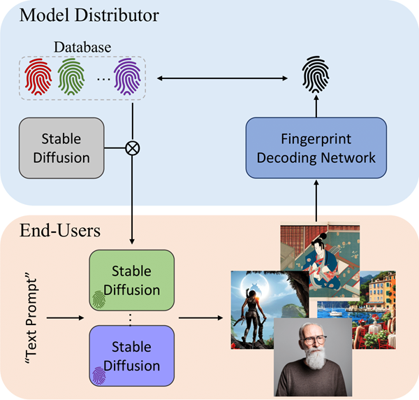

# WOUAF
WOUAF: Weight Modulation for User Attribution and Fingerprinting in Text-to-Image Diffusion Models (CVPR 2024)\
[**Paper**](https://arxiv.org/pdf/2306.04744.pdf) | [**Project page**](https://wouaf.vercel.app/) | [**Demo**](https://huggingface.co/spaces/wouaf/WOUAF-Text-to-Image)

## Overview

We introduce a novel approach to model fingerprinting that assigns responsibility for the generated images, thereby serving as a potential countermeasure to model misuse. We modify generative models based on each user’s unique digital fingerprint, imprinting a unique identifier onto the resultant content that can be traced back to the user. WOUAF, incorporating finetuning into Text-to-Image (T2I) tasks using the Stable Diffusion Model, demonstrates near-perfect attribution accuracy with a minimal impact on output quality.

## Requirements
Preliminary requirements:
- Python>=3.5
- PyTorch==1.12.1

Run the following command:
```
pip3 install -r requirements.txt
```

## Code Usage
First, clone this repository and download the pre-extracted latent vectors for validation: [Google Drive](https://drive.google.com/drive/folders/1h_YS5L_GA1ujy9QTrZy5EEHAY5601rir?usp=drive_link).
Then, use `trainval_WOUAF.py` to train and evaluate the model:
```
CUDA_VISIBLE_DEVICES=0 python trainval_WOUAF.py \
    --pretrained_model_name_or_path stabilityai/stable-diffusion-2-base \
    --dataset_name HuggingFaceM4/COCO \
    --dataset_config_name 2014_captions --caption_column sentences_raw \
    --center_crop --random_flip \
    --dataloader_num_workers 4 \
    --train_steps_per_epoch 1_000 \
    --max_train_steps 50_000 \
    --pre_latents latents/HuggingFaceM4/COCO
```

## Note
- Our code builds on the [fine-tuning scripts for Stable Diffusion from Diffusers](https://github.com/huggingface/diffusers/tree/main/examples/text_to_image).
- The implementation of MappingNetwork is from [StyleGAN2-ADA](https://github.com/NVlabs/stylegan2-ada-pytorch).

## Citation
```bibtex
@inproceedings{kim2024wouaf,
  title={WOUAF: Weight modulation for user attribution and fingerprinting in text-to-image diffusion models},
  author={Kim, Changhoon and Min, Kyle and Patel, Maitreya and Cheng, Sheng and Yang, Yezhou},
  booktitle={Proceedings of the IEEE/CVF Conference on Computer Vision and Pattern Recognition},
  pages={8974--8983},
  year={2024}
}
```
